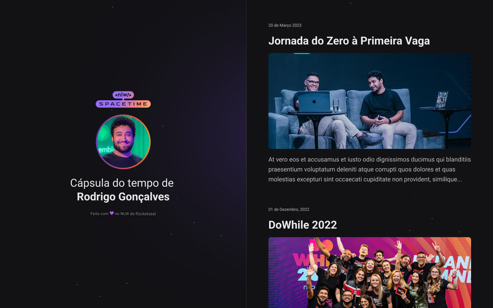

## 💻 About the Project
This is a responsive web project about a time capsule to display memories in a timeline

## 🚀 Technologies
This project was developed during the NLW by RocketSeat with following technologies:

- HTML
- CSS
- Git e Github

## 🏷️ Layout
You can see the layout from the project through [this link](https://www.figma.com/file/UtpUkb9K1BttsG20KzrAEY/C%C3%A1psula-do-tempo-%E2%80%A2-Trilha-Explorer-(Community)?type=design&node-id=306%3A3&t=IIv7zHqnHwvkSPB7-1)
Its necessary has an account in [Figma](https://www.figma.com)
